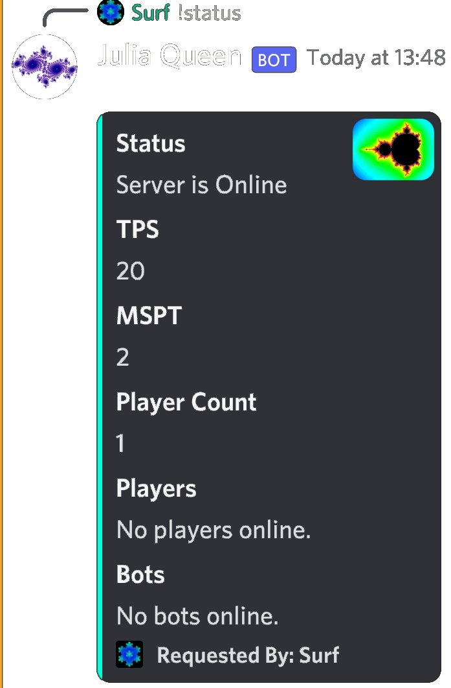
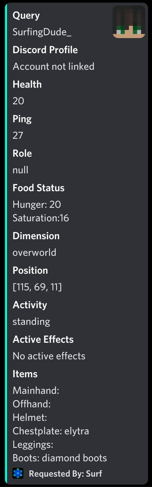
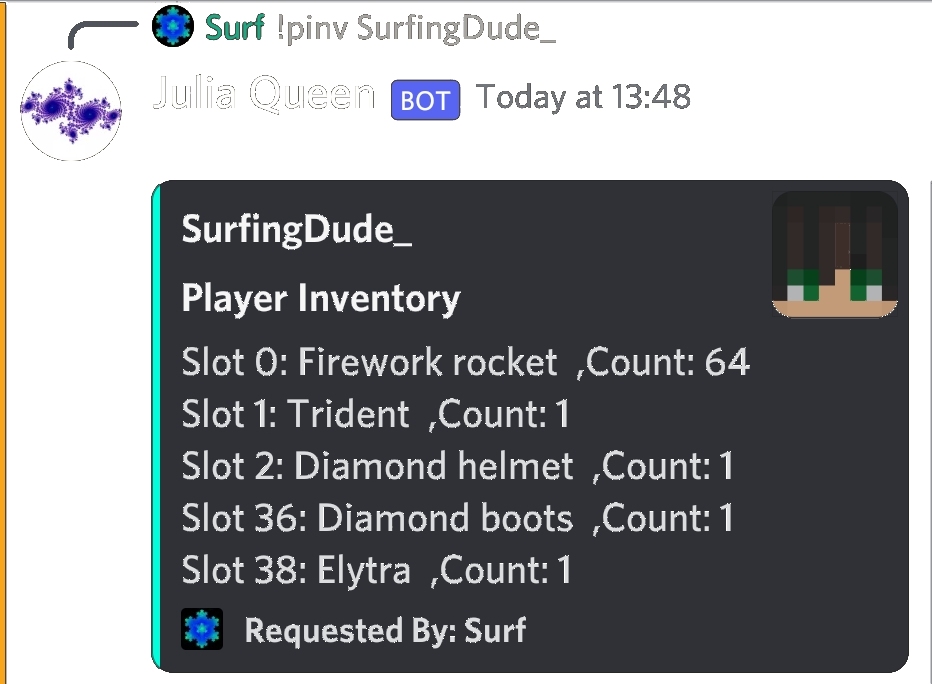
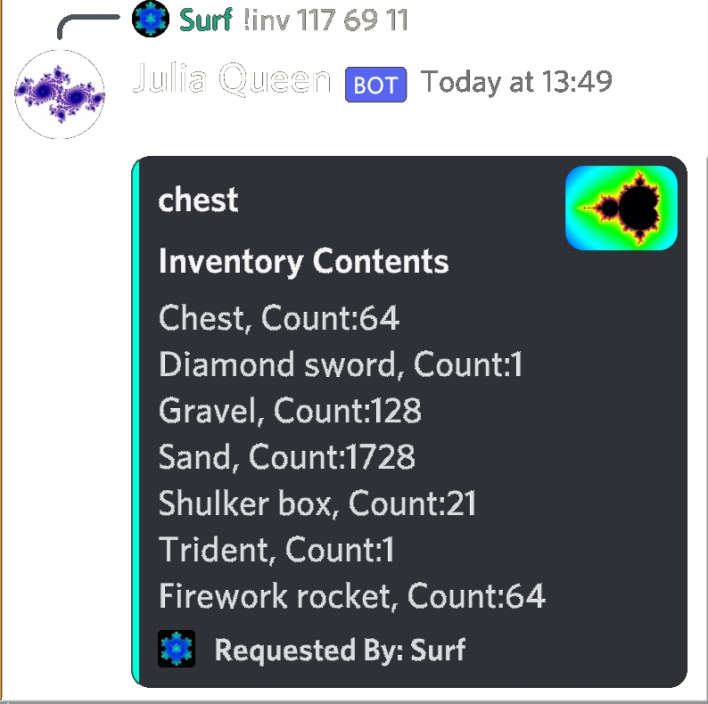
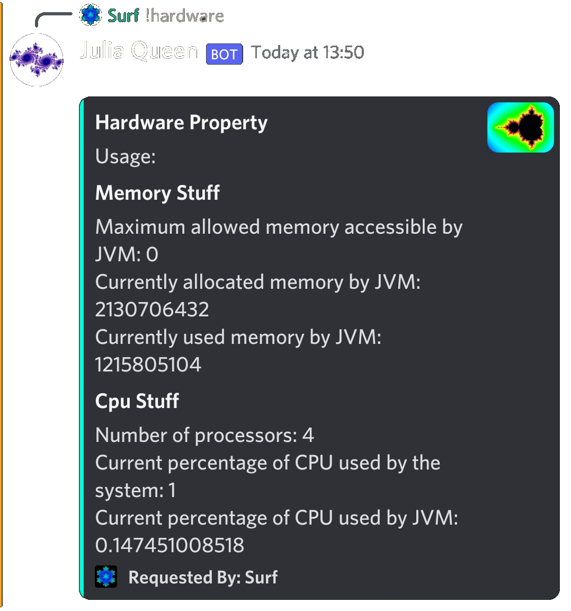

# Fractal Link
Advanced querying tool for Technical Minecraft Servers and anyone else who wants to spy on their server members.
For more information or if server owners/ members want to test this out. Ping me in the chat or dm me on discord.
If servers admins or members are intrested I will probably make the testing discord server public as a preview of features before adding it to their servers.

Requirements: Discarpet, Carpet Mod
 
## Chat Features

The general discord to minecraft formating is almost a replica of Xujiayao's [MCDiscordChat](https://github.com/Xujiayao/MCDiscordChat). Fractal Link also uses similar webhook format to display each player individually.

The notable difference between Fractal Link and all other discord -> minecraft chat links (as far as I know), is Fractal Link's easy interface to click links send via discord. It opens it directly in your default web browser. Adding to this Fractal Link also helps you in sharing schematic files(or any other file format) very easily.
Simply share the file in discord chat, and on cliicking the download button in game. The file is automatically downloaded using your default web browser.

Note: Malicious files can be shared, so be sure to download files from trusted users only. (This should hopefully be changed in a future release)

There is also a feature to specify a channel to post basic server log in, accesible only by the admins.

## Commands List

The primary command is !help. It will show a list of all commands and their usages. By default all commands only work in the assigned chat channel

Note: You can disable enable most of these commands. All the embeds show in picture are mobile view, desktop/browser is a bit more compact due to usage of inline fields.

### 1. Status

Like most generic status commands out there, tells basics of server. Only notable difference: it can differentiate between carpet bots and player when displaying. (Don't mind the picture, it doesnt work for singleplayer players)

### 2. Query

Allows you to query properties of a player. Gives various information regarding health, hunger, etc. The included picture contains all queryable information.
Note: It is possible to disable some of the more intrusive ones and customize it to your server needs.

### 3. Pinv

Allows you to query the inventory of a player/bot. (IMproper ',' usage I know)

### 4. Inv

General world inventory access command. Allows you to check how much redstone you have in your storage without logging in. Note: YOU NEED TO KNOW THE LOCATION OF CHEST.

### 5. Deepinv

Tells you more about the item in some particular spot in block inventory (player inventory was a whole lot intrusive to add). Split into two different cases, one for shulkers and other for general items. For shulkers it displays their content like a inv command and for other item it displays their nbt.

General Item (Diamond Sword):

Shulker Box :

### 6. Console

Allows the user to run some command on console. Also displays output. Note: You need to specify a role, if you need to use this.

### 7. Hardware

Credits to chezlock and chronos team for this idea. Ths is a bit unpolished right now, the names will be better in future releases for stupid people like me.

### 8. Link and Unlink

They don't serve any great purpose right now except telling what discord id is of a player. But in future, they absoluetly will. Check Issues for more info.

## Credits

1.  [Xujiayao's](https://github.com/Xujiayao) [MCDiscordChat](https://github.com/Xujiayao/MCDiscordChat) for heavily inspiring teh chat.
2.  [Chronos Server](https://github.com/ChronosServer) for giving great ideas.
3.  [Replace Item](https://github.com/replaceitem) for making [Discarpet](https://github.com/replaceitem/carpet-discarpet) 
4.  Everyone in [Carpet Discord](https://discord.gg/gn99m4QRY4) for helping me with my dumb questions and issues
